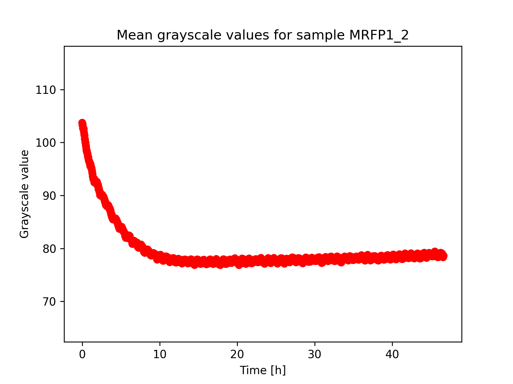
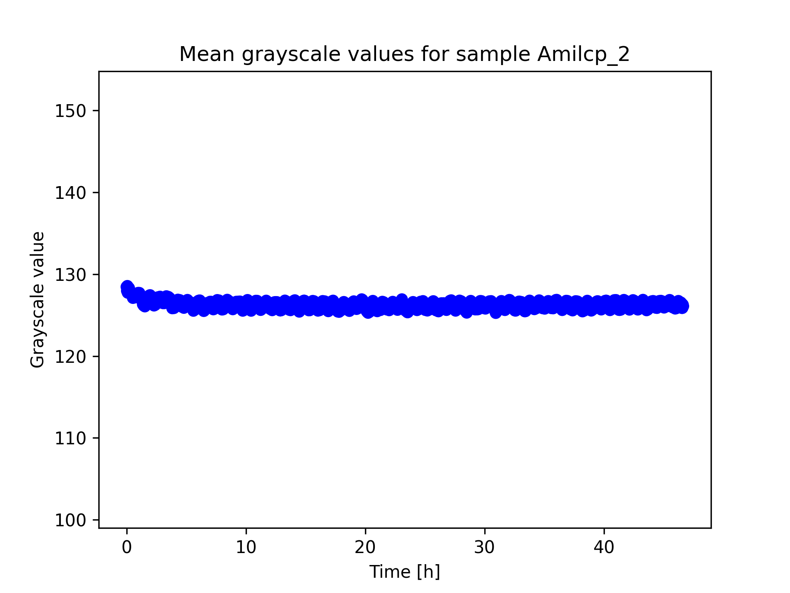
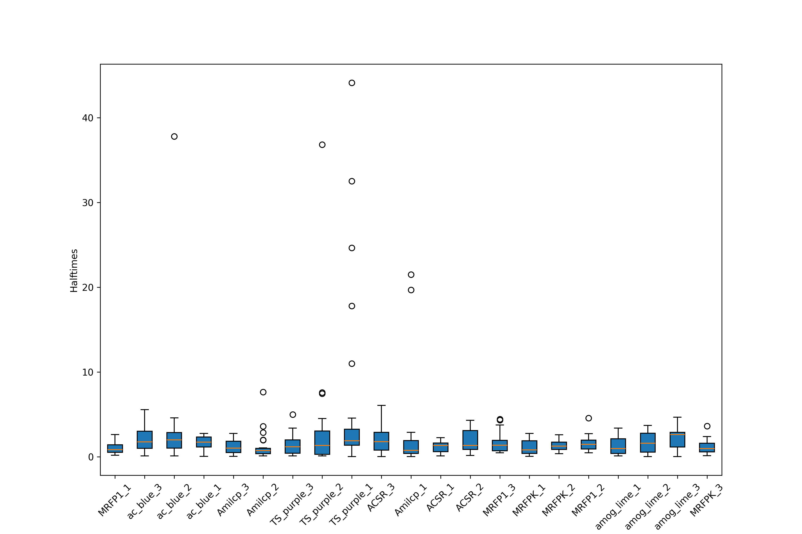

# ChromaMature

ChromaMature is a software developed to measure the maturation time of color development using image analysis on timelaps. It can be used for many different purposes. The main use was to determine the maturation time of chromoproteins in a cheap and easy way. You can read about our work and results on:

https://2024.igem.wiki/uppsalauniversity/measurement

The assay has been worked on since then with new results shown in the example folder

## How to use

The first thing that you need to do is set up your samples in a way that you have a constant light source and that your chosen camera does not auto adjust. Set up the camera to take a timelaps of your samples and save the pictures to a directory.

### Setup virtual environment

If you want to, you could start a virtual environment to run the pipeline on.

```
python3 -m venv venv
. venv/bin/activate # on Linux, MacOS; or
. venv\Scripts\activate # on Windows
pip install -r requirements.txt
```

### Get the coordinates for the samples

The first thing you should do is to mark the coordinates of your samples in your picture. You do this by running the get_coords.py script. You will be prompted to choose a picture. You should choose a picture where you can clearly see the developed colors. Fill then out a sample name and the color of the sample (this will just be the color of the scatterplot). You can now press on your sample and the coordinates will be saved to a .csv file. For each sample, you are recommended to take at least 20 points if possible.

### Run the analysis

To run the analysis, you need to run the following command:

```
python3 chromamature.py -c /path/to/coords/data.csv -o /path/to/output/directory -ip /path/to/images/directory -n name_of_run -p -t minutes_between_pictures
```

where the flags -p stands for parallelization to use more computational resources.

To find all options run:

```
python3 chromamature.py -h
```

## Interpret the results

After running the analysis, you should get some scatterplots, a boxplot, a .txt file and a .csv file. The examples shown are from one of our analysis. We grew our bacteria anaerobically so the bacteria would produce the chromoprotein, but the protein would not develop any color.

### Scatterplots

The scatterplots show the mean grayscale value for each timestamp/image. We would assume that we should get a larger drop in the start and then see a stagnation in the development of the color. These are two examples of a good plot where we see a clear change in the curve (red) and one less good where there is a very small change (blue). Here you should trust the maturation halftime results of the red curve more than for the blue.

 

### Boxplot

The boxplot will show you the halftime of your sample. For each point you took in the sample, the halftime is calculated and then combined to the boxplot. A more compact box will show a more concise result than for a more spread out box.



### bootstrap_results.txt

The bootstrap file has the mean maturation halftime and the bootstrap confidence interval (95%) for the halftime. The tighter the confidence interval is, the better. Here you can see what the measured halftime is and how likely the answer is correct.
